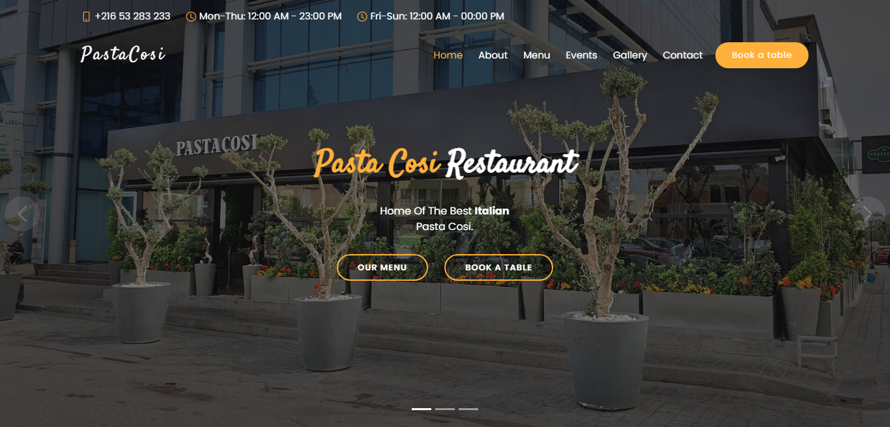

Pastacosi Restaurant is a simple, modern and responsive website for restaurants, made with Bootstrap.

# Install

- Clone the repository:

```bash
git clone https://github.com/juilirk/Restaurant-App.git
```

- Open **`index.html`** in your browser, and enjoy !

# Used libraries

- JavaScript
- CSS
- Bootstrap5
- Bootstrap-icons
- Swiper
- Isotope
- Animate.css
